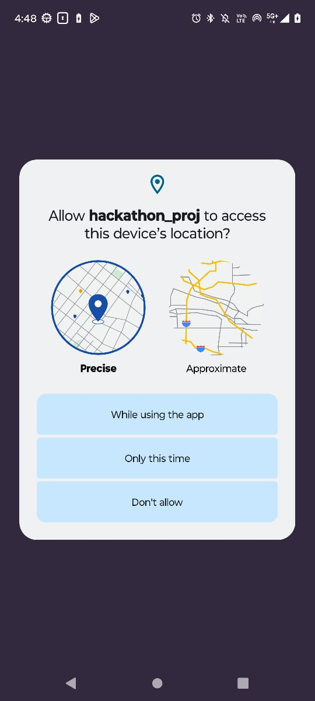

# 
<h1 align="center"> SAMPOORNA    </h1>

### 

<i>Completeness Through Inclusivity</i>

  

## Table of Contents

1. [Problem Statement](#problem-statement)
2. [About the project](#about-the-project)
   - [Video Link](#detailed-video-link)
   - [UN 17 Goals](#un-17-goals)
   - [Salient features](#salient-features)
3. [Technology Stack](#technology-stack)
4. [Compatibility](#compatibility)
5. [Tour through the App](#tour-through-the-app)
6. [Flow of the app](#flow-of-the-app)
7. [Implementation of Agile Methodology](#implementation-of-agile-methodology)
8. [Installation](#installation)
9. [Special Instructions to Work with the App](#special-instructions-to-work-with-the-app)
10. [Challenges Faced](#challenges-faced)
11. [Future Scope](#future-scope)
12. [Support and Contact](#future-scope)

## Problem Statement
    
In today's society, individuals with disabilities face numerous challenges, including limited access to essential services and a lack of volunteer support. The emotional toll of navigating daily life under these circumstances is significant. Existing applications often fail to adequately address the multifaceted needs of this community. Hence, there is a critical need for a dedicated solution that actively tackles these issues, providing a secure and supportive environment for individuals with disabilities.
 
[(Back to the top)](#-Sampoorna--)

## About the project

Our project is dedicated to empowering individuals with disabilities by providing a comprehensive application focused on safety, inclusivity, and empowerment. In addition to fostering connections and accessing resources, our app prioritizes mental safety through features like Medicare and SOS. By offering a holistic approach to support, we aim to enhance the overall well-being and quality of life for our users .
### Detailed Video Link 
[Video](https://drive.google.com/file/d/111IIwF8BKKPQE5E7nwStyRVviHRraSkM/view)

### UN 17 Goals 

 

- Our target is to achieve gender equality and empower all people with disability. 
We are fulfilling:  
**Goal 3**: Good Health and Well-being: Sampoorna promotes the physical and mental well-being of individuals with disabilities by offering features such as Medicare, which helps users manage their healthcare needs, including prescriptions and medical records. Additionally, the mood tracking feature contributes to monitoring and improving mental health, ensuring that users have access to resources and support to maintain overall well-being.
   **Goal 10**: Reduced Inequalities: By focusing on inclusivity and empowerment, your app aims to reduce inequalities faced by individuals with disabilities. Through features like Connect Me, users can access counselors, volunteers, and NGOs for personalized support, thereby bridging the gap in access to essential services. Furthermore, the recommendation feature encourages the creation of disabled-friendly environments, promoting inclusivity and accessibility in communities.
 

### Salient Features

**Connect Me**: Facilitates connections with counselors, nearby volunteers, and NGOs for personalized support and assistance. 
**Education and Mood Tracking:** Offers a diverse range of educational content accessible in various formats, accompanied by a mood tracking feature to monitor emotional well-being.
 
**Report and Recommendation**: Empowers users to recommend disabled-friendly locations and services, promoting inclusivity and accessibility.  
**Medicare**: Streamlines healthcare management by enabling users to maintain medical records, set prescription reminders, and access healthcare services conveniently.  
**Community**: Fosters a supportive online community where users can connect with peers facing similar challenges, share experiences, and provide mutual support.  
**Feed**: Provides a platform for users to share personal insights, stories, and resources through blog posts, fostering community engagement and empowerment.  
**SOS**: Implements an emergency alert system that enables users to swiftly notify designated contacts of their distress and share their live location for immediate assistance.  
**Chatbot**: Offers AI-powered assistance to users, providing information, guidance, and support in real-time.  

[(Back to the top)](#-Sampoorna--)

## Technology Stack

 

- Flutter and Dart were used to develop the application.
- Necessary packages were imported from pub.dev.
- The backend has been implemented using Firebase. (Firebase authentication, Firestore and Firebase Storage have been used).
- Access to live location using geolocator and Google Maps plugins.
- The locations have been fetched using Google Maps.
- Google DialogFlow is used for implementing chat bot support.
- Helpbot support with Google DialogFlow.
- AI-powered chatbot support using Google Gemini bot.

[(Back to the top)](#-Sampoorna--)

## Compatibility

The flutter application is compatible to run on android smart phones.

[(Back to the top)](#-Sampoorna--)

## Tour through the App
- <h3>Onboarding Screens</h3>

  <figure>
  <kbd>
   
<figcaption> 
 Access Location Permission
</figcaption>

     </figure>&nbsp;&nbsp;&nbsp;&nbsp;&nbsp;&nbsp;
   <figure>
  <kbd>
   
<figcaption> 
 
</figcaption>

     </figure>&nbsp;&nbsp;&nbsp;&nbsp;&nbsp;&nbsp;
    <figure>
  <kbd>
   
<figcaption> 
  
</figcaption>

     </figure>&nbsp;&nbsp;&nbsp;&nbsp;&nbsp;&nbsp;
      <figure>
  <kbd>
   
<figcaption> 
  
</figcaption>

     </figure>&nbsp;&nbsp;&nbsp;&nbsp;&nbsp;&nbsp;  
      <figure>
  <kbd>
   
<figcaption> 
  
</figcaption>

     </figure>&nbsp;&nbsp;&nbsp;&nbsp;&nbsp;&nbsp;  
      <figure>
  <kbd>
   
<figcaption> 
 
</figcaption>

     </figure>&nbsp;&nbsp;&nbsp;&nbsp;&nbsp;&nbsp;  

      
- <h3> User Authentication Screens</h3>

   <figure style="padding-right: 20px;" >
  <kbd>
   
<figcaption> 
 Login Screen
</figcaption>

     </figure>&nbsp;&nbsp;&nbsp;&nbsp;&nbsp;&nbsp;
  <figure>
  <kbd>
   
<figcaption> 
Create Account 
</figcaption>

     </figure>&nbsp;&nbsp;&nbsp;&nbsp;&nbsp;&nbsp;
   <figure>
  <kbd>
   
<figcaption> 
 Types of Disabilities
</figcaption>

     </figure>&nbsp;&nbsp;&nbsp;&nbsp;&nbsp;&nbsp;
    <figure>
  <kbd>
   
<figcaption> 
 Forgot Password Screen
</figcaption>

     </figure
         <figure>
  <kbd>
   
<figcaption> 
 E-mail Verification
</figcaption>

     </figure>
      <figure>
  <kbd>
   
<figcaption> 
  
</figcaption>

     </figure>
      <figure>
  <kbd>
   
<figcaption> 
  
</figcaption>

     </figure>
      <figure>
  <kbd>
   
<figcaption> 
 Safety Call
</figcaption>

     </figure>
 
    

- <h3> Dashboard Screens</h3>

   <figure style="padding-right: 20px;" >
  <kbd>
   
<figcaption> 
 
</figcaption>

     </figure>&nbsp;&nbsp;&nbsp;&nbsp;&nbsp;&nbsp;
  <figure>
  <kbd>
   
<figcaption> 
 
</figcaption>

     </figure>&nbsp;&nbsp;&nbsp;&nbsp;&nbsp;&nbsp;
   <figure>
  <kbd>
   
<figcaption> 
 
</figcaption>

     </figure>&nbsp;&nbsp;&nbsp;&nbsp;&nbsp;&nbsp;
    <figure>
  <kbd>
   
<figcaption> 
  n
</figcaption>

     </figure
         <figure>
  <kbd>
   
<figcaption> 
 
</figcaption>

     </figure>
      <figure>
  <kbd>
   
<figcaption> 
  
</figcaption>

     </figure>
      <figure>
  <kbd>
   
<figcaption> 
  
</figcaption>

     </figure>
      <figure>
  <kbd>
   
<figcaption> 
  
</figcaption>

     </figure>
 
    

- <h3>Features</h3>    
 <h3> SOS</h3>

   <figure style="padding-right: 20px;" >
  <kbd>
   
<figcaption> 
 
</figcaption>

     </figure>&nbsp;&nbsp;&nbsp;&nbsp;&nbsp;&nbsp;
  <figure>
  <kbd>
   
<figcaption> 
 
</figcaption>

     </figure>&nbsp;&nbsp;&nbsp;&nbsp;&nbsp;&nbsp;
   <figure>
  <kbd>
   
<figcaption> 
 Education
</figcaption>

     </figure>&nbsp;&nbsp;&nbsp;&nbsp;&nbsp;&nbsp;
    <figure>
 
    

 <h3> Report and Recommendation</h3>

   <figure style="padding-right: 20px;" >
  <kbd>
   
<figcaption> 

</figcaption>

     </figure>&nbsp;&nbsp;&nbsp;&nbsp;&nbsp;&nbsp;
  <figure>
  <kbd>
   
<figcaption> 

</figcaption>

     </figure>&nbsp;&nbsp;&nbsp;&nbsp;&nbsp;&nbsp;
   <figure>
   <kbd>
   
<figcaption> 

</figcaption>

     </figure>&nbsp;&nbsp;&nbsp;&nbsp;&nbsp;&nbsp;
       <figure>
   <kbd>
   
<figcaption> 

</figcaption>

     </figure>&nbsp;&nbsp;&nbsp;&nbsp;&nbsp;&nbsp;
   <figure>
 
    

    
    
    
## Flow of the App

[(Back to the top)](#-shakti--)
    
    
## Implementation of Agile Methodology

### What is Agile?
Agile is a development methodology adopted today in the software industry. Agile promotes teamwork, flexible procedures, and sle-organizing teams.

### How we incorporated Agile Methodology during the development cycle?
SCRUM is a subset of Agile, a framework for developing software.The basic time working unit is the sprint. SCRUM teams always reason in sprints and their planning is limited to sprints.

- Sprint 1: *Research and Design*
- Sprint 2: *Building the application*
- Sprint 3: *Testing and debugging* 
     
    
### How it helped us?

- It made the app development process more efficient and predictable.
- We worked on functionalities looking at them as smaller units of the larger app due to which the process was easy to handle, flexible and allowed more room to adjust new functionalities.

[(Back to the top)](#-shakti--)
    

## Installation

Initialise git on your terminal:

git init

 

Clone this repository:
 
git clone https://github.com/pragati-gangwar/Sampoorna

 

Change the directory.

cd Sampoorna/

      
 
      
      
Run the packages get command in your project directory:

flutter pub get

 

Once the build is complete, run the run command to start the app:

flutter run

In case you encounter the error A problem occurred evaluating project ':tflite',

you should change this on ~\tflite-1.1.2\android\build.gradle:

dependencies {
    compile 'org.tensorflow:tensorflow-lite:+'
    compile 'org.tensorflow:tensorflow-lite-gpu:+'
}

to this:

dependencies {
    implementation 'org.tensorflow:tensorflow-lite:+'
    implementation 'org.tensorflow:tensorflow-lite-gpu:+'
} 

[(Back to the top)](#-shakti--)
    
## Special Instructions to Work with the App

1. The application can only be run on android physical devices. Due to the app being heavy, it would not work on virtual emulators smoothly.

2. Permission to use Camera, Location, Contacts, Messaging etc should be given whenever prompted.

[(Back to the top)](#-Sampoorna--)

## Challenges Faced
1. The features decided to serve as small applications in themselves- grouping together would be a major task by selecting the appropriate technology.
2. The flutter depreciations, the amount of load an application takes, and updations in firebase were also taken into consideration.
3. Another challenge was to select UI theme as it should be appealing to attract specially abled people to the app. It should reflect feeling of being at peace, safe, 
   strong, and empowered. Our users should feel comfortable while using the app.

[(Back to the top)](#-Sampoorna--)
    
## Future Scope

Personalized Dashboards for Diverse Disabilities:  
- Introduce disability-specific dashboards catering to various disabilities, offering customized content and features. 
Dual Interfaces for User and Volunteer Registration:  
- Expand the app to feature two distinct interfaces – one for users with disabilities and another for volunteers and medical professionals during the registration process. 
Future Job Listings:  
 - Plan for a job listing section that caters to disability-friendly employment opportunities, promoting economic empowerment.  
Tailored Content Curation:  
- Implement machine learning algorithms for personalized content delivery, curating news, blogs, and NGO information based on individual disability profiles.

[(Back to the top)](#-Sampoorna--)

.
